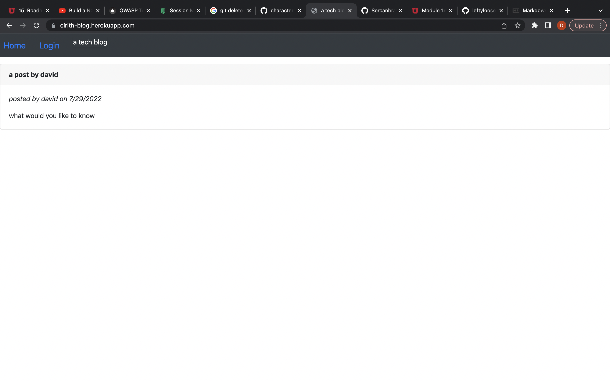

A Tech Blog

## Welcome

This is a simple blog app, built for MVC practice. I used Node, Express,
Mysql, and Sequelize to build it, with express-session for authentication. I
Bootstrap'd the simple little frontend. Users, comments, and posts live in a mySQL database that is crudely grafted onto that simple little frontend with RESTful API and query selectors.

It is deployed to heroku. Anyone can
come, create an account, and create posts and comment on other people's posts.
Not many people do. Because no one on earth knows it exists. But now you know it
exists. You could write something about tech news. You could write anything.
Please don't curse.

[heroku deployment](https://cirith-blog.herokuapp.com/)

